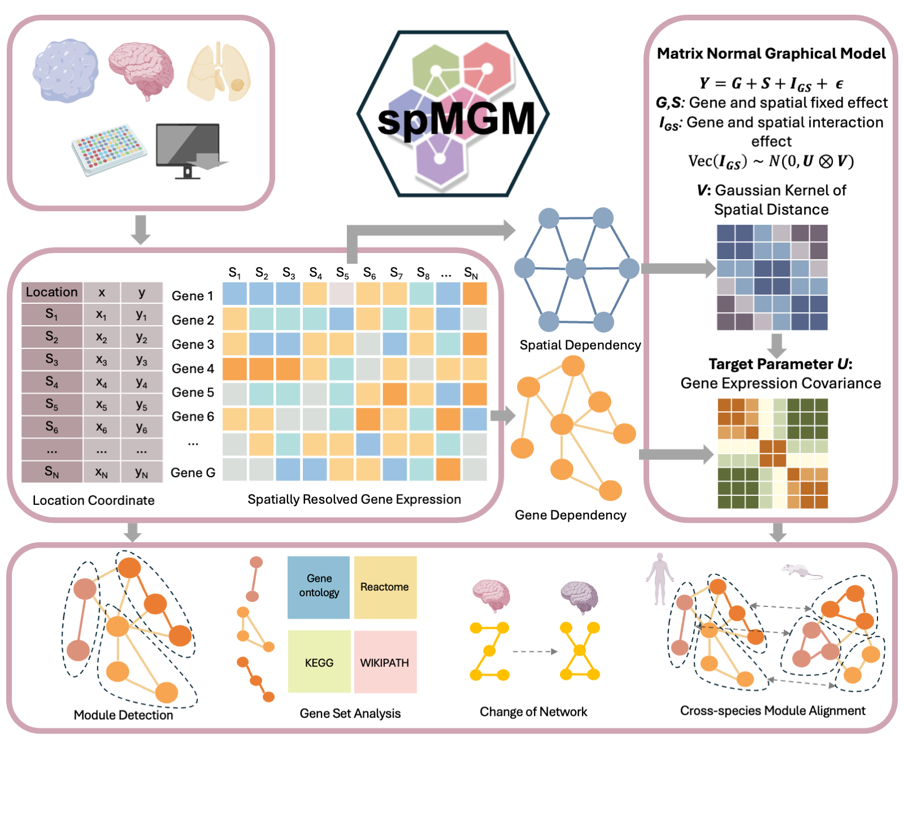

# spMGM

## Spatially Informed Matrix Normal Graphical Model for Inferring Gene Co-expression Networks in Spatial Transcriptomics



spMGM is a spatially informed matrix normal graphical model developed to interpret gene co-expression patterns across spatial locations in a biologically meaningful way. spMGM builds upon the principle that gene expression in spatial transcriptomics data is influenced by both spatial covariance and gene covariance, as well as interactions between genes and spatial locations. Using a normalized spatial count matrix as input, spMGM integrates these elements to yield a more accurate and nuanced understanding of gene co-expression networks with spatial contexts. spMGM employs an efficient optimization algorithm for maximum likelihood estimation, which is scalable to datasets with tens of thousands of spatial locations and tens of thousands of genes, surpassing the capabilities of existing methods. spMGM is implemented as an open-source R package, freely available at https://github.com/orgs/YMa-lab/spMGM

Installation
------------
You can install the released version of CARD from Github with the following code, for more installation details or solutions that might solve related issues (specifically MacOS system) see the [link](https://yma-lab.github.io/CARD/documentation/02_installation.html).

## Dependencies 
* R version >= 4.2.2.
* R packages: Matrix, ggplot2, dplyr, sf, stats, reshape2, gtools, RcppArmadillo, Rcpp

``` r
# install devtools if necessary
install.packages('devtools')

# install the CARD package
devtools::install_github('YingMa0107/CARD')

# load package
library(CARD)

```
The R package has been installed successfully on Operating systems: 
* macOS Catalina 10.15, macOS Monterey 12.3.1
* Ubuntu 18.04.5 LTS (Bionic Beaver) 
* Windows 10

# Issues
All feedback, bug reports and suggestions are warmly welcomed! Please make sure to raise issues with a detailed and reproducible exmple and also please provide the output of your sessionInfo() in R! 

How to cite `CARD`
-------------------
Ma, Y., Zhou, X. Spatially informed cell-type deconvolution for spatial transcriptomics. Nat Biotechnol 40, 1349–1359 (2022). https://doi.org/10.1038/s41587-022-01273-7

How to use `CARD`
-------------------
Details in [Tutorial](https://yma-lab.github.io/CARD/)
