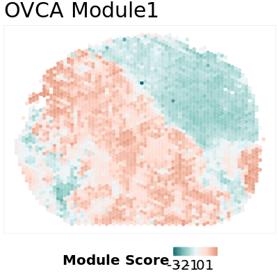

In this vignette, we use the 10x Visium Ovarian Carcinoma data download from [10x Genomics Data Platform](https://www.10xgenomics.com/datasets/human-ovarian-cancer-1-standard). The preprocessed raw count matrix and spatial coordinate data are stored in [Data](https://yma-lab.github.io/spMOCA/documentation/03_data.html). Before runing the tutorial, make sure that the spMOCA package is installed. Installation instructions see the [link](https://yma-lab.github.io/spMOCA/documentation/02_installation.html)

## Required input data
`spMOCA` requires spatial transcriptomics count data, along with spatial location information as inputs. The example data for runing the tutorial can be downloaded in this [page](https://yma-lab.github.io/spMOCA/documentation/03_data.html)
Here are the details about the required data input illustrated by the example datasets. 

### spatial transcriptomics data
```r
#### Loading raw count data
count_data = readRDS("./OVCA.10xGenomicsFFPE.count.mat.rds") # count matrix
all_gene = rownames(count_data)
count_data[1:4,1:4]
4 x 4 sparse Matrix of class "dgCMatrix"
        CCAAAGTCCCGCTAAC-1 GTTACGGCCCGACTGC-1 TAGTGAGAAGTGGTTG-1
SAMD11                   .                  .                  .
NOC2L                    .                  1                  .
KLHL17                   .                  .                  .
PLEKHN1                  .                  .                  1
        AAACAATCTACTAGCA-1
SAMD11                   .
NOC2L                    1
KLHL17                   .
PLEKHN1                  .

#### Loading location coordinate
location = readRDS("./OVCA.10xGenomicsFFPE.location.rds")

#### Check whether the orders of location dimension are matched in two matrix
all(location$barcode == colnames(count_data))

#### re-format location dataframe
location = as.data.frame(location)
rownames(location) = location$barcode
location = location[,c("pxl_row_in_fullres","pxl_col_in_fullres")]
colnames(location) = c("x","y")
all_gene = rownames(count_data)


location[1:4,]
                      x    y
CCAAAGTCCCGCTAAC-1 2176 5193
GTTACGGCCCGACTGC-1 2176 5337
TAGTGAGAAGTGGTTG-1 2177 5482
AAACAATCTACTAGCA-1 2177 5626
```

## Gene Co-expression Analysis
```r
library(spMOCA)
``` 
### 1. Create an `spMOCA` object, Normalizaiton and Feature Selection.
The spMOCA object is created by the function `createspMOCAObject`. The essential inputs are:
- spatial_countMat: a gene-by-location raw count matrix
- spatial_location: a location-by-2 spatial coordinate
- feature_list: a list of pre-specified features

After that we performed a log transformation with a library size factor normalization. We performed a feature section by detecting spatial variable genes (SVGs) using SPARK [Sun et al.](https://www.nature.com/articles/s41592-019-0701-7). Usually it will take a while for running SPARK. To save time for this tutorial, we provide the SPARK genes for OVCA data. The gene list can be download at in this [page](https://yma-lab.github.io/spMOCA/documentation/03_data.html).

```r
##### Create spMOCA object
object = createSPMOCAObject(spatial_countMat = count_data,
                            spatial_location = location,
                            feature_list = all_gene)

#### Normalization
object = normalizeSPMOCA(object)

#### Feature Selection
gene_spark = read.table("./OVCA.10xGenomicsFFPE.spark.gene.txt")$x
object = featureSelectionSPMOCA(object,
                                feature.selection = NULL,
                                feature.list = gene_spark)
```
The raw spatial data are stored in `object@spatial_countMat` and `object@spatial_location`, the normalized count are stored in `object@spatial_normCount` and the updated selected features are stored in `object@feature_select`. 

# 3. Construct Spatial Kernel and Run `spMOCA` to estimate gene-gene correlation
This is the essential step to construct spatial kernel and estimate gene-gene correlation given the spatial kernel. A gene-gene correlation matrix is estimated using all selected features.

```r
#### Construct Spatial Kernel
object = createSpatialKernel(object)
object@spatial_kernel[1:4,1:4]
                  CCAAAGTCCCGCTAAC-1 GTTACGGCCCGACTGC-1 TAGTGAGAAGTGGTTG-1 AAACAATCTACTAGCA-1
CCAAAGTCCCGCTAAC-1          1.0000000          0.9768075          0.9098124          0.8088262
GTTACGGCCCGACTGC-1          0.9768075          1.0000000          0.9764870          0.9098124
TAGTGAGAAGTGGTTG-1          0.9098124          0.9764870          1.0000000          0.9768075
AAACAATCTACTAGCA-1          0.8088262          0.9098124          0.9768075          1.0000000

#### Estimate Gene-Gene Correlation
object = estimatespMOCA(object)
object@corr_est[1:4,1:4]
             SAMD11        NOC2L      PLEKHN1        HES4
SAMD11   1.00000000  0.021498659 -0.013438931 -0.03762820
NOC2L    0.02149866  1.000000000  0.004930792 -0.02916415
PLEKHN1 -0.01343893  0.004930793  1.000000000  0.00329313
HES4    -0.03762820 -0.029164151  0.003293133  1.00000000
```
The estimated gene-gene correlation matrix is stored in `object@corr_est`, while the spatial kernel is stored in `object@spatial_kernel`

# 3. Downstream analysis on gene co-expression network  

## 3.1 Extract gene module from gene-gene correlation matrix

We apply [WGCNA](https://bmcbioinformatics.biomedcentral.com/articles/10.1186/1471-2105-9-559) to extract gene modules. In particular, we use `spMOCA` estimated gene-gene correlation  as an input to perform clustering for genes through WGCNA.
```r
library(WGCNA)
#### Perform Module Detection
object = moduleDetectionspMOCA(object)
object@network[1:4,]
          kTotal   kWithin     kOut     kDiff k    gene
SAMD11  5089.710 2237.6663 2852.043  -614.377 1  SAMD11
NOC2L   5099.643  280.7110 4818.932 -4538.221 6   NOC2L
PLEKHN1 5093.970  795.8440 4298.126 -3502.282 2 PLEKHN1
HES4    5100.408  544.6427 4555.765 -4011.123 4    HES4
```
The output of WGCNA is stored in `object@network`. The table includes the important measurements such as `kTotal` global connectivity/degree, `kWithin` within-module connectivity/degree, `k` module membership and `gene` feature name. We then can visualize Top 1% module hub genes with the largest within-module connectivity from this GCN:


## 3.2 Calculate Network Degree and Module Scores

We can further calculate module scores using top 5% hub genes as representatives. Module score are calculated by average expression level for the representativie genes for each module in each location. The details of module score calculation is in our manuscript [manuscript](link). 

```r
ms_prop = calModuleScore(object)
### Visualize Module Score
ms = scale(ms_prop[,1])
ms[which(is.na(ms),arr.ind = T)] = 0

df.ms = cbind(location,ms)
colnames(df.ms) = c("x","y","score")

ggplot(df.ms,aes(x = x,y = y,color = score)) +
  geom_point(size = 3) +
  labs(color = "Module Score",
       title = paste0("OVCA Module1")) +
  scale_color_gradientn(colours = c("#006D77","#83C5BE","#EDF6F9","#FFDDD2","#E29578")) +
  theme(plot.margin = margin(0.1, 0.1, 0.1, 0.1, "cm"),
        panel.background = element_blank(),
        plot.background = element_blank(),
        plot.title = element_text(size = 30),
        panel.border = element_rect(colour = "grey89", fill=NA, size=0.5),
        axis.text =element_blank(),
        axis.ticks =element_blank(),
        axis.title =element_blank(),
        legend.title=element_text(size = 20,face="bold"),
        legend.text=element_text(size = 20),
        legend.key = element_rect(colour = "transparent", fill = "white"),
        legend.key.size = unit(0.45, 'cm'),
        strip.text = element_text(size = 16,face="bold"),
        legend.position="bottom")
```
Here is an example output: 




