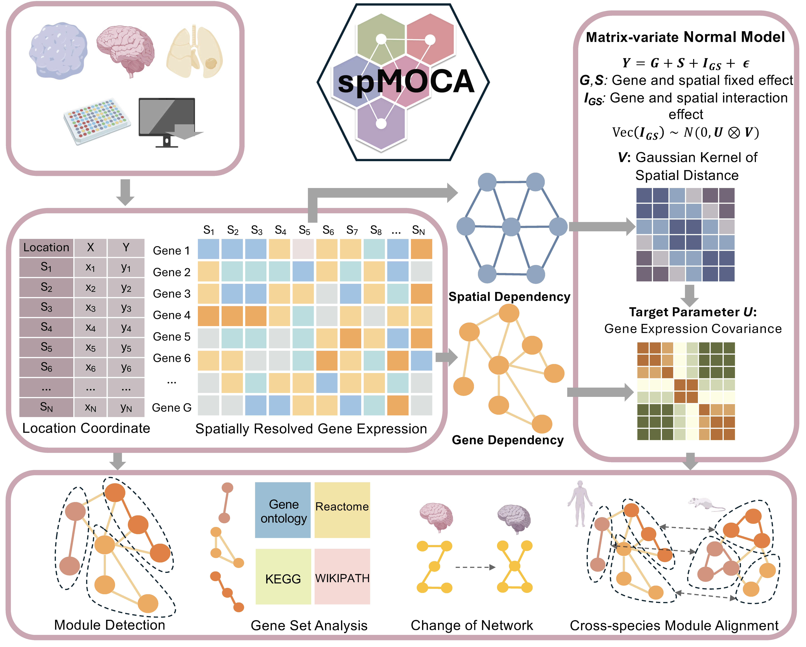

## spMOCA Overview

spMOCA is a spatially informed matrix normal model developed to interpret gene co-expression patterns across spatial locations in a biologically meaningful way. spMOCA builds upon the principle that gene expression in spatial transcriptomics data is influenced by both spatial covariance and gene covariance, as well as interactions between genes and spatial locations. Using a normalized spatial count matrix as input, spMOCA integrates these elements to yield a more accurate and nuanced understanding of gene co-expression networks with spatial contexts. spMOCA employs an efficient optimization algorithm for maximum likelihood estimation, which is scalable to datasets with tens of thousands of spatial locations and tens of thousands of genes, surpassing the capabilities of existing methods. spMOCA is implemented as an open-source R package, freely available at https://github.com/orgs/YMa-lab/spMOCA.

### Example Analysis with spMOCA: [here](https://yma-lab.github.io/spMOCA/documentation/04_CARD_Example.html).
